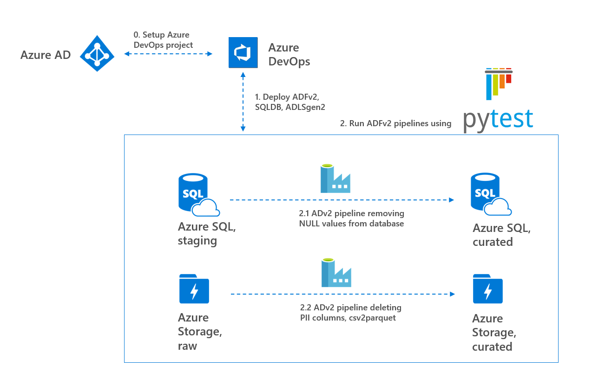
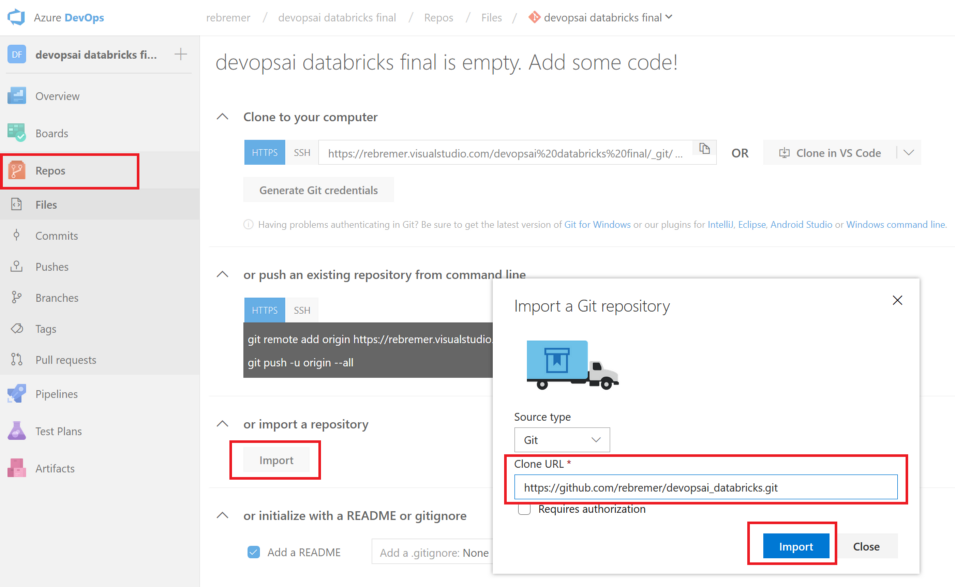
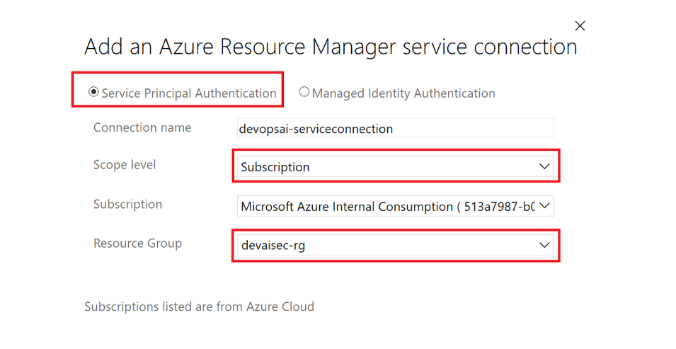
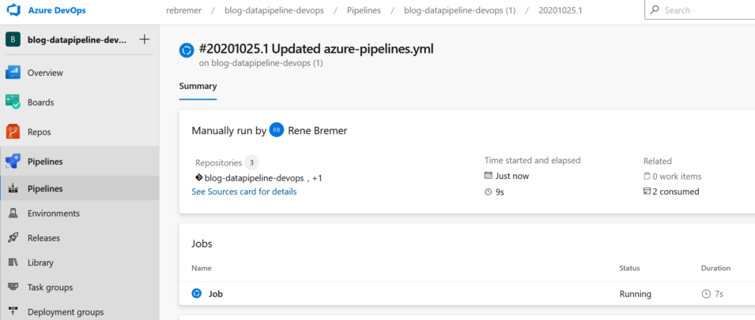

# Data Factory unit test using Azure DevOps and pytest
*TLTR: Create Azure DevOps pipeline using azure-pipelines.yml, change variables and run ADFv2 unit test*

Project that creates a unit test in Data Factory. Key in this project is the following:

- In unit testing it is important to limit external dependencies and to standardize input/output data. 
  - In this project, a bacpac file is restored to a SQLDB and a csv file is added to the storage account as part of the deployment process. This way the input/output data can be controlled.
- In unit testing it is also important to focus tests on (complex) business logic rather than testing standard algorithms or third party libaries.
  - In this project, business logic in Dataflows is tested by checking input/output data using pytest

The following steps will be executed:

0. Setup Azure DevOps CI/CD project 
1. Create build artifact containing all scripts and deploy resources in release pipeline
2. Run unit tests as part of release pipeline with pytest. The following pytests on ADFv2 are executed:
   - ADFv2 pipeline that removes null values in SQLDB table 
   - ADFv2 pipeline that deletes PII columns and converts csv2parquet in ADLSgen2.

See also picture bleow



## 0. Setup Azure DevOps CI/CD project 

In this chapter, the project comes to live and the modern data pipeline using architecture described in chapter B.
- 0.1 Prerequisites
- 0.2 Create Azure DevOps project
- 0.3 Create Service connection
- 0.4 Configure and build/release YAML pipeline

### 0.1 Prerequisites

The following resources are required in this tutorial:

- [Azure Account](https://azure.microsoft.com/en-us/free/)
- [Azure DevOps](https://azure.microsoft.com/en-us/services/devops/)
- [Azure CLI](https://docs.microsoft.com/en-us/cli/azure/install-azure-cli?view=azure-cli-latest) (recommended, also for troubleshooting)

Subsequently, go to the Azure portal and create a resource group in which all Azure resources will be deployed. This can also be done using the following Azure CLI command:

```azurecli-interactive
az group create -n <<your resource group>> -l <<your location>>
```

### 0.2 Create Azure DevOps project

Azure DevOps is the tool to continuously build, test, and deploy your code to any platform and cloud. Create a new project in Azure DevOps by following  tutorial. Once you create a new project, click on the repository folder and select to import the following repository:

- https://github.com/rebremer/blog-adfv2unittest-git

See also picture below. 


### 0.3 Create Service connection

A Service connection is needed to access the resources in the resource group from Azure DevOps. Go to project settings, service connection and then select Azure Resource Manager. Select Service Principal Authentication and limit scope to your resource group which you created earlier, see also picture below.



By default, the Service Principal (SPN) of the service connection has Contributor rights to the resource group. However, for this pipeline the SPN needs Owner rights (or additional User Access Administrator rights next to Contributor) on the resource group, since the ADFv2 MI needs to get granted RBAC rights to the ADLSgen2 account. When clicking on “Manage Service Principal” on your service connection in Azure DevOps, the application id can be found. Use the following Azure CLI script to assign owner rights to the SPN (can also be done in portal):

```azurecli-interactive
# get your subscription id
az account list
# create role
az role assignment create --assignee "<<application id>>" --role "Owner" --scope "/subscriptions/<<your subscription Id>> /resourcegroups/<<resource group name>>"
```

Finally, verify if the SPN was assigned Owner role to your resource group in the Azure Portal or using CLI command below.

```azurecli-interactive
az role assignment list --resource-group <<resource group name>>
```

### 0.4 Configure and build/release YAML pipeline

Go to your Azure DevOps project, select Pipelines and then click “New pipeline”. Go to the wizard, select the Azure Repos Git and the git repo you created earlier. In the tab configure, choose “Existing Azure Pipelines YAML file” and then azure-pipelines.yml that can be found in the git repo, see also below.
C2.1. In pipeline Configure wizard, select Existing Azure Pipelines YAML file, image by author

Subsequently, the following variables need to be substituted with your own values:

```
variables: 
  #
  # 1. Azure DevOps settings, change with your own
  AzureServiceConnectionId: '<<your service connection Id>> '
  SUBSCRIPTIONID: '<<your subscription Id>> '
```

Once the variables are substituted, the pipeline is created and run immediatelly, see below.



## 1. Deploy ADFv2, SQLDB and ADLSgen2 using Azure DevOps

In the first step of the Azure DevOps pipeline, ADFv2, SQLDB and ADLSgen2 are deployed. After deployment is done, it can be verified using Azure CLI whether all resources are deployed.

```azurecli-interactive
az resource list -g <<your resource group>>
```

## 2. Run ADFv2 using pytest. The following pipelines are executed:

In the second step of the Azure DevOps pipeline, two ADFv2 pipelines are deployed. It can be verified in the ADFv2 monitor tab whether both pipelines were executed. In the pytest results, it can be verified whether the tests were successful. The following tests are executed for both pipelines:

- sqldb-dataflows-remove-nullvalues:
  - Pipeline returned HTTP 200 after being triggered by REST
  - Check whether not time out occured in pipeline
  - Check whether table OrdersAggregated was created and does not contain NULL values in comment columns
- adlsgen2-dataflows-delete-piicolumns:
  - Pipeline returned HTTP 200 after being triggered by REST
  - Check whether not time out occured in pipeline
  - Check whether file AdultCensusIncomePIIremoved.parquet can be found in curated file system of ADLSgen2
  - Check whether PII sensitive age column was removed from parquet file